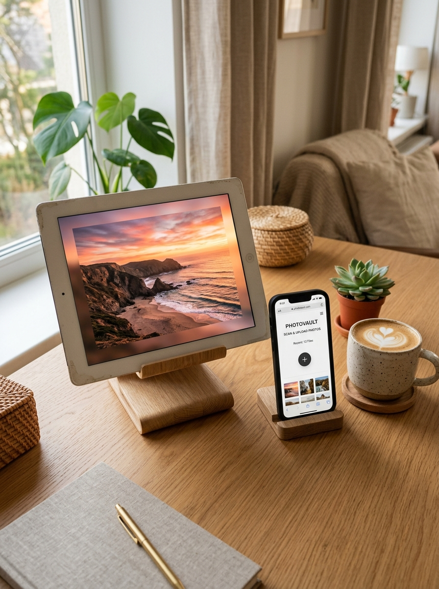

<div align="center">

# 🖼️ 智能相框 (Smart Photo Frame)

**把吃灰的闲置平板、旧手机，秒变客厅艺术数码相框**

[](https://github.com/ccisnice/smart-photo-frame/releases)
[](https://www.gnu.org/licenses/gpl-3.0)
[](#)
[](https://github.com/ccisnice/smart-photo-frame/pulls)

<br/>



<br/><br/>

[📥 下载最新安卓 APK 安装包](https://github.com/ccisnice/smart-photo-frame/releases/latest) • [✨ 核心亮点](#-核心亮点) • [📱 快速安装](#-快速开始与安装) • [☕️ 请作者喝杯咖啡](#️-请作者喝杯咖啡)

</div>

---

### 💡 为什么做这个项目？

家里很多退役的**旧 iPad、闲置安卓平板**，卖二手不值钱，丢抽屉里吃灰又可惜。市面上的数码相框动辄大几百上千元，还要担心云端相册泄漏隐私。

**「智能相框」专为拯救旧设备而生**：
不用买任何额外硬件，不用搭复杂服务器。装上即用，手机直接扫码投送，纯家庭局域网点对点传输，保护全家隐私！

---

## ✨ 核心亮点

- 🚀 **独立自愈微服务（脱离电脑独立运行）**：
  安卓 App 内置极轻量级局域网服务，**谁安装谁就是相框主机**，完全摆脱对电脑的依赖。
- 📱 **手机扫码极速投送**：
  相框屏幕右上角轻触即可唤出专属二维码，手机（iPhone/安卓）无需装 App，连入同个 Wi-Fi 用微信或自带相机扫码即开网页传片。
- ⚡ **前端 2K 智能画质压缩**：
  手机上传多张动辄十几兆的原图时，浏览器端自动完成 2K 视网膜级保真压缩，**体积缩减 90%~95%**，大幅降低老旧平板的存储压力与传输耗时。
- 🎨 **动态流光高斯氛围背景**：
  彻底告别竖屏照片/视频在平板上播放时的丑陋黑边！底层采用 GPU 硬件加速，自动提取主色调生成流动高斯光晕，100% 完整展现原片构图。
- 🔄 **360° 全向重力自适应**：
  横屏放就横屏展示，竖着放自动转成竖屏，倒着放也能毫秒级瞬间摆正。
- 🕶️ **纯净艺术沉浸模式**：
  彻底隐藏系统顶部状态栏（时间、电池、信号）与底部虚拟导航栏，插电放置永不黑屏休眠（硬件+软件双重常亮锁）。
- 🔒 **100% 局域网私有（零云端泄漏风险）**：
  零远程服务器介入、零数据收集、零商业广告，所有照片点对点存在你自己的设备沙盒中。

---

## 📱 快速开始与安装

### 方案 A：安卓平板 / 安卓旧手机（推荐 ⭐⭐⭐⭐⭐）
1. 前往 **[Releases 页面](https://github.com/ccisnice/smart-photo-frame/releases/latest)** 下载最新的 `智能相框.apk`；
2. 安装到平板后打开，平板会自动建立本地相框服务；
3. 用手机扫描平板屏幕上的二维码，挑选照片发送即可！

### 方案 B：苹果 iPad（iOS / iPadOS）
1. 用 iPad 的 Safari 浏览器访问局域网地址（如配套 NAS 或电脑启动）；
2. 点击 Safari 分享按钮 -> **「添加到主屏幕」**；
3. 从桌面打开即可享受全屏无边框的 PWA 原生相框体验。

### 方案 C：Docker / NAS / 私有云部署
如果你习惯用家里常开的群晖、威联通、飞牛私有云（fnOS）统一管理家庭照片：
```bash
# 一键拉取并运行
docker run -d \
  --name photo-frame \
  -p 8000:8000 \
  -v /你的照片目录:/app/media \
  --restart unless-stopped \
  ccisnice/smart-photo-frame:latest
```

---

## 🛠️ 技术架构

- **跨平台核心**：Capacitor 8.x + HTML5 / Modern Vanilla CSS / ES6+
- **端侧独立服务**：NanoHTTPD (Android Native) / Python 3 Async (Server/Docker)
- **图像引擎**：HTML5 Canvas 2K Resampling + GPU Accelerated CSS Filter
- **传输协议**：HTTP 206 Partial Content (支持 iOS Safari 分段平滑流式播放)

---

## ☕️ 请作者喝杯咖啡

如果你喜欢这个开源小工具，它帮你的闲置平板焕发了新生，欢迎请作者喝杯咖啡鼓励持续维护与更新！

<div align="center">
  
  <br/>
  <p><strong>微信扫一扫上方赞赏码，请野生独立开发者喝杯咖啡 ☕️</strong></p>
</div>

> 欢迎在打赏时备注你的 GitHub ID，我会将你列入项目的 **Sponsors（致谢赞助名单）**！❤️

---

## 📄 开源许可证

本项目基于 [GPL v3 (GNU General Public License v3.0)](LICENSE) 协议开源。
商业使用或二次分发衍生作品必须遵守 GPLv3 规定保持开源，保护开源社区生态。
